<div style="text-align: center; margin-bottom: 15px;">
    
</div>

# Manual de usuario: plataforma de benchmarking de algoritmos de rutas más cortas

Ingeniería en Sistemas Computacionales

**Grupo:** 6° "C".

**Asignatura:** Lenguajes y Autómatas II.

**Tema 3:** Optimización.

**Proyecto:** Desarrollo de un software de benchmarking.

**Equipo de desarrollo:**

*   Cauich Pat Pedro Antonio.
*   Chan Xooc Brenda Argelia.
*   Corona Noh Gabriel Danneshe.
*   Pat Canche Karla Cristina.

**Docente:** M.M.D. José Leonel Pech May.

**Fecha de entrega:** 6 de mayo de 2026

**Repositorio oficial:** [https://github.com/20pedro01/Sistema-de-benchmarking-de-grafos](https://github.com/20pedro01/Sistema-de-benchmarking-de-grafos)

---

### [1. Índice general](#1-indice-general)

<div class="toc-list">
<ul>
    <li><a href="#1-indice-general">1. Índice general <span>2</span></a></li>
    <li><a href="#2-indice-de-imagenes">2. Índice de imágenes <span>3</span></a></li>
    <li><a href="#3-introduccion">3. Introducción <span>4</span></a></li>
    <li><a href="#4-marco-teorico-algoritmos-de-ruta-mas-corta">4. Marco teórico (algoritmos de ruta más corta) <span>4</span></a>
        <ul>
            <li><a href="#41-algoritmo-de-dijkstra">4.1 Algoritmo de Dijkstra <span>4</span></a></li>
            <li><a href="#42-algoritmo-de-bellman-ford-optimizacion-spfa">4.2 Algoritmo de Bellman-Ford (SPFA) <span>4</span></a></li>
        </ul>
    </li>
    <li><a href="#5-justificacion-de-herramientas-de-medicion">5. Justificación de herramientas de medición <span>5</span></a></li>
    <li><a href="#6-instalacion-y-ejecucion">6. Instalación y ejecución <span>5</span></a></li>
    <li><a href="#7-guia-detallada-de-casos-de-uso">7. Guía detallada de casos de uso <span>6</span></a>
        <ul>
            <li><a href="#71-navegacion-inicial-y-bienvenida">7.1 Navegación inicial y bienvenida <span>6</span></a></li>
            <li><a href="#72-configuracion-de-un-grafo-estandar">7.2 Configuración de un grafo estándar <span>7</span></a></li>
            <li><a href="#73-inyeccion-de-pesos-negativos">7.3 Inyección de pesos negativos <span>7</span></a></li>
            <li><a href="#74-inyeccion-y-deteccion-de-ciclos-negativos">7.4 Inyección y detección de ciclos <span>8</span></a></li>
            <li><a href="#75-pruebas-de-estres-modo-masivo">7.5 Pruebas de estrés (modo masivo) <span>9</span></a></li>
            <li><a href="#76-comparativa-y-analisis-de-resultados">7.6 Comparativa y análisis de resultados <span>10</span></a></li>
            <li><a href="#77-exportacion-de-evidencia-tecnica">7.7 Exportación de evidencia técnica <span>10</span></a></li>
        </ul>
    </li>
    <li><a href="#8-gestion-de-estados-de-la-interfaz">8. Gestión de estados de la interfaz <span>11</span></a></li>
    <li><a href="#9-resultados-experimentales-y-analisis-de-escalabilidad">9. Resultados experimentales y análisis de escalabilidad <span>12</span></a>
        <ul>
            <li><a href="#91-escenario-micro-auditoria-visual">9.1 Escenario micro <span>13</span></a></li>
            <li><a href="#92-escenario-macro-analisis-de-rutas-complejas">9.2 Escenario macro <span>13</span></a></li>
            <li><a href="#93-escenario-stress-procesamiento-masivo">9.3 Escenario de stress <span>14</span></a></li>
            <li><a href="#94-escenario-de-anomalia-deteccion-de-ciclos-y-pesos-negativos">9.4 Escenario de anomalía <span>14</span></a></li>
            <li><a href="#95-escenario-de-ciclo-negativo-deteccion-de-anomalia-critica">9.5 Escenario de ciclo negativo <span>15</span></a></li>
            <li><a href="#96-resumen-de-interpretacion-tecnica">9.6 Resumen de interpretación técnica <span>15</span></a></li>
        </ul>
    </li>
    <li><a href="#10-conclusion">10. Conclusión <span>16</span></a></li>
</ul>
</div>

---

<div class="page-break"></div>

### [2. Índice de imágenes](#1-indice-general)

<div class="toc-list">
<ul>
    <li><a href="#img1">Imagen 1: consola de ejecución exitosa. <span>6</span></a></li>
    <li><a href="#img2">Imagen 2: tarjeta de bienvenida y dashboard. <span>6</span></a></li>
    <li><a href="#img3">Imagen 3: panel de configuración y validaciones. <span>7</span></a></li>
    <li><a href="#img4">Imagen 4: visualización de grafo y tabla de adyacencia. <span>7</span></a></li>
    <li><a href="#img5">Imagen 5: panel de inyectores dinámicos. <span>8</span></a></li>
    <li><a href="#img6">Imagen 6: panel de resultados con alerta de ciclo detectado. <span>9</span></a></li>
    <li><a href="#img7">Imagen 7: resultados de benchmark con anomalía detectada. <span>9</span></a></li>
    <li><a href="#img8">Imagen 8: modo stress con lienzo oculto. <span>9</span></a></li>
    <li><a href="#img9">Imagen 9: velocímetros de tiempo de ejecución. <span>10</span></a></li>
    <li><a href="#img10">Imagen 10: comparativa de consumo de memoria. <span>10</span></a></li>
    <li><a href="#img11">Imagen 11: guardado del reporte PDF. <span>11</span></a></li>
    <li><a href="#img12">Imagen 12: visualización del reporte PDF. <span>11</span></a></li>
    <li><a href="#img13">Imagen 13: ejemplo de transición de estados de la UI. <span>12</span></a></li>
    <li><a href="#img14">Imagen 14: resultados en escala pequeña (micro). <span>13</span></a></li>
    <li><a href="#img15">Imagen 15: resultados en escala mediana (macro). <span>13</span></a></li>
    <li><a href="#img16">Imagen 16: resultados en escala masiva (stress). <span>14</span></a></li>
    <li><a href="#img17">Imagen 17: comportamiento ante pesos negativos aislados <span>14</span></a></li>
    <li><a href="#img18">Imagen 18: comportamiento ante un ciclo negativo. <span>15</span></a></li>
</ul>
</div>

---

---

<div class="page-break"></div>

### [3. Introducción](#1-indice-general)

El presente manual describe el funcionamiento y la arquitectura de la plataforma de benchmarking de grafos. En el ámbito de la optimización y la ingeniería de software, el análisis empírico de algoritmos es fundamental para determinar cuál solución se adapta mejor a restricciones de tiempo y memoria en condiciones reales. Este software permite comparar dos enfoques clásicos para la búsqueda de rutas mínimas: Dijkstra y Bellman-Ford, evaluando no solo su velocidad, sino su robustez ante grafos complejos, pesos negativos y ciclos de ganancia infinita.

---

### 4. Marco teórico (algoritmos de ruta más corta)

#### [4.1 Algoritmo de Dijkstra](#1-indice-general)
Ésta técnica voraz consiste en tomar la mejor decisión "local" en cada paso (el camino que parece más corto en ese preciso momento) con la esperanza de que estas decisiones lleven a la solución óptima global.

*   **Funcionamiento:** utiliza una cola de prioridad para explorar siempre el nodo más cercano no visitado.
*   **Complejidad:** *O*((V+E) log V) con colas de prioridad.
*   **Limitación:** su enfoque miope ("voraz") le impide reconsiderar rutas una vez marcadas como definitivas, por lo que falla silenciosamente ante pesos negativos.

#### [4.2 Algoritmo de Bellman-Ford (optimización SPFA)](#1-indice-general)
Utiliza un enfoque de **programación dinámica**. Esta técnica consiste en resolver un problema complejo dividiéndolo en subproblemas más simples.

*   **Funcionamiento:** el sistema implementa la variante **SPFA (Shortest Path Faster Algorithm)**, la cual utiliza una cola dinámica para procesar solo los nodos cuyas distancias han sido actualizadas.
*   **Complejidad:** *O*(*k* × *E*) en promedio (donde *k* es una constante pequeña), lo que permite procesar 10 millones de nodos en segundos, superando ampliamente el *O*(*V* × *E*) tradicional.
*   **Ventaja:** detecta **ciclos negativos** de forma ágil, informando que no existe una ruta mínima finita y deteniendo el proceso para evitar bucles infinitos.

---

### [5. Justificación de herramientas de medición](#1-indice-general)

Para asegurar la precisión académica del benchmark, se seleccionaron herramientas que permiten mediciones a bajo nivel:

*   **Tiempo (time.perf_counter):** se utiliza esta función por su alta resolución (nanosegundos), ideal para medir latencias críticas en algoritmos de optimización.

*   **Memoria (resource.ru_maxrss):** en lugar de *tracemalloc*, que rastrea cada objeto de Python, se utilizó RSS para medir la memoria física real (Resident Set Size) consumida por el proceso en el sistema operativo, ofreciendo una métrica de impacto real en el hardware.

*   **Algoritmos (Motor Híbrido):** se implementó un sistema dual que utiliza **SciPy (C++)** para máxima velocidad en grafos estándar y un motor **SPFA optimizado** para garantizar que el benchmark sea escalable hasta 10 millones de nodos sin perder la capacidad de detección académica de anomalías.

---

### [6. Instalación y ejecución](#1-indice-general)

Para poner en marcha el sistema, siga estos pasos:

1.  **Clonación del repositorio:**

```bash
git clone https://github.com/20pedro01/Sistema-de-benchmarking-de-grafos
cd Sistema-de-benchmarking-de-grafos
```

2.  **Instalación de dependencias:**

Asegúrese de tener Python 3.10+ instalado en su sistema y ejecute el siguiente comando en su terminal:

```bash
python3 -m pip install customtkinter networkx matplotlib scipy reportlab pillow
```

3.  **Ejecución del software:**

Una vez instaladas las dependencias, inicie la aplicación con:

```bash
python3 ui.py
```

<div id="img1"></div>
> **[Imagen 1: consola de ejecución exitosa.](#2-indice-de-imagenes)** 
> 
> [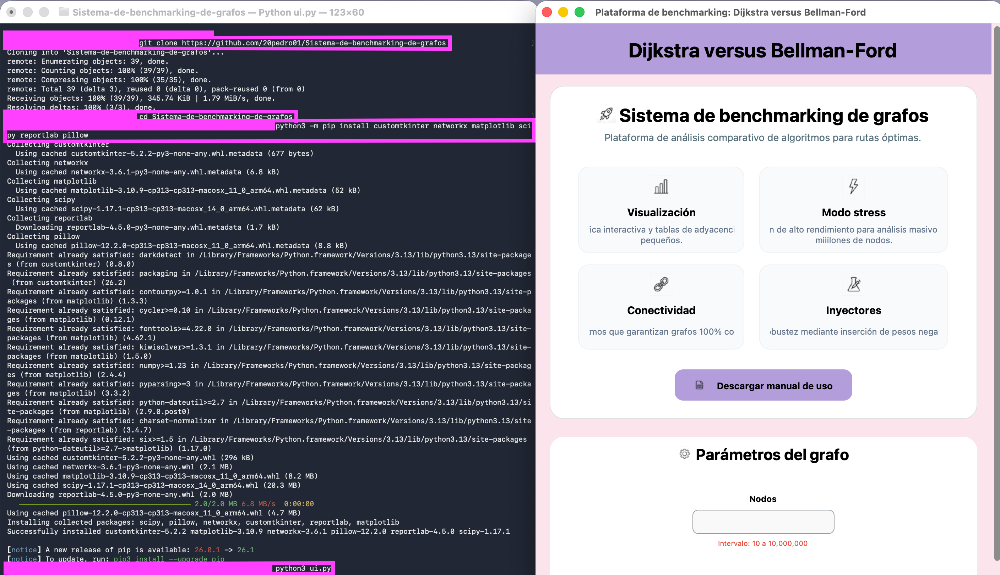](#2-indice-de-imagenes)
> 
> *Pie de imagen: ventana de comandos mostrando el inicio correcto del sistema y la carga de módulos.*


---

### 7. Guía detallada de casos de uso

#### [7.1 Navegación inicial y bienvenida](#1-indice-general)
Al iniciar la aplicación, se presenta una tarjeta de bienvenida que resume las capacidades del sistema (visualización, modo stress, conectividad e inyectores). Desde aquí, el usuario puede acceder directamente a este manual.

<div id="img2"></div>
> **[Imagen 2: tarjeta de bienvenida y dashboard.](#2-indice-de-imagenes)**  
> 
> [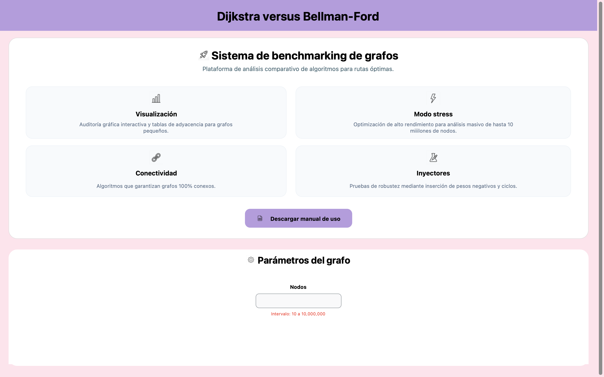](#2-indice-de-imagenes)
> 
> *Pie de imagen: interfaz principal con el botón de descarga del manual de uso.*


#### [7.2 Configuración de un grafo estándar](#1-indice-general)
Para una auditoría visual, ingrese un número de nodos entre 10 y 20 y una densidad baja (menor a 30%). Al presionar "Generar", el sistema dibujará el grafo y mostrará su tabla de adyacencia.

> **Paso de confirmación:** tras la generación, es obligatorio presionar el botón **"Confirmar grafo"**. Este paso bloquea la configuración inicial y habilita las herramientas de inyección y el botón de ejecución del benchmark.


<div id="img3"></div>
> **[Imagen 3: panel de configuración y validaciones.](#2-indice-de-imagenes)**  
> 
> [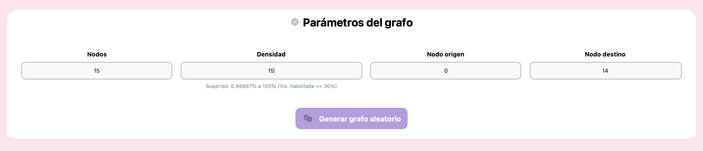](#2-indice-de-imagenes)
> 
> *Pie de imagen: entrada de parámetros con avisos de sugerencia para garantizar conectividad.*

<div id="img4"></div>
> **[Imagen 4: visualización de grafo y tabla de adyacencia.](#2-indice-de-imagenes)**  
> 
> [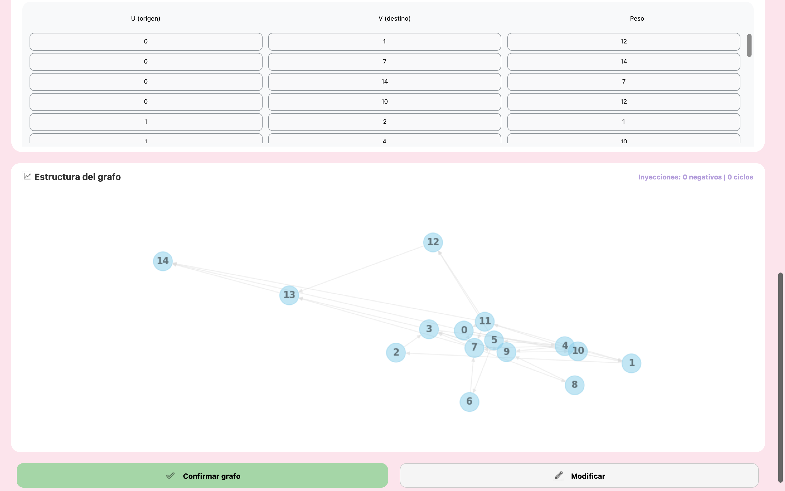](#2-indice-de-imagenes)
> 
> *Pie de imagen: renderizado interactivo de un grafo pequeño con sus respectivos pesos.*

#### [7.3 Inyección de pesos negativos](#1-indice-general)
Este caso permite observar cómo los algoritmos reaccionan ante aristas que reducen el costo total del camino. El sistema calcula automáticamente un límite de inyección para no saturar la red.

> **Consideraciones de fallo y rendimiento:**
>
> *   **Rendimiento:** en grafos con muy pocos nodos (ej. 10 nodos), la diferencia de tiempo entre Dijkstra y Bellman-Ford puede ser mínima o incluso **Dijkstra puede resultar más lento** debido al sobrecosto inicial de gestionar la cola de prioridad frente a una simple relajación de aristas. Sin embargo, conforme aumenta el tamaño del grafo, la superioridad de Dijkstra se vuelve notoria y exponencial.
> *   **Fallo condicional:** el hecho de inyectar pesos negativos o ciclos no garantiza un fallo inmediato en el resultado de Dijkstra. El fallo (inexactitud) solo ocurrirá si la ruta más corta calculada por el algoritmo pasa obligatoriamente por el área inyectada. Esto depende del tamaño del grafo, la cantidad de pesos inyectados y la topología resultante.

>
<div id="img5"></div>
> **[Imagen 5: panel de inyectores dinámicos.](#2-indice-de-imagenes)** 
> 
> [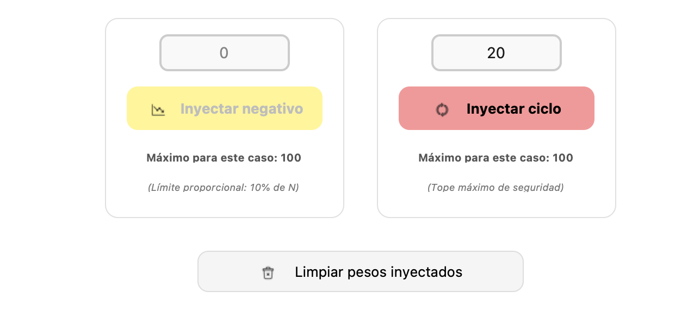](#2-indice-de-imagenes)
> 
> *Pie de imagen: controles de inyección bloqueados hasta que se ingresa un valor válido.*

#### [7.4 Inyección y detección de ciclos negativos](#1-indice-general)
Al inyectar un ciclo negativo, el sistema realiza una validación lógica inmediata. Es importante destacar que la estructura visual del grafo y la tabla de adyacencia se mantienen íntegras para permitir la auditoría de los datos originales.

La detección de la anomalía se manifiesta a través de tres indicadores clave:

1.  **Indicadores de estado:** el botón de inyección y las etiquetas de estado confirman la operación realizada.
2.  **Velocímetros de rendimiento:** el indicador de Bellman-Ford cambiará a color <span style="color: red; font-weight: bold;">rojo</span> si se detecta que el algoritmo se detuvo debido a un ciclo.
3.  **Tarjeta de resultados:** se despliega una alerta en el panel de resultados indicando: *"ciclo negativo: Dijkstra es inválido. Bellman-Ford detectó la anomalía"*.

<div id="img6"></div>
> **[Imagen 6: panel de resultados con alerta de ciclo detectado.](#2-indice-de-imagenes)**  
> 
> [](#2-indice-de-imagenes)
> 
> *Pie de imagen: el sistema informa la invalidez del cálculo de Dijkstra y la detección exitosa de Bellman-Ford.*

<div id="img7"></div>
> **[Imagen 7: resultados de benchmark con anomalía detectada.](#2-indice-de-imagenes)**  
>
> [](#2-indice-de-imagenes)
>
> *Pie de imagen: comparativa donde Bellman-Ford detecta el ciclo y Dijkstra entrega un valor erróneo o infinito.*

#### [7.5 Pruebas de estrés (modo masivo)](#1-indice-general)
Cuando el número de nodos es superior a 20 o la densidad es muy alta, el sistema entra en **modo stress**. El lienzo se oculta para optimizar recursos y se enfoca exclusivamente en la precisión de las métricas de tiempo y memoria. El límite máximo es de 10 millones de nodos.

<div id="img8"></div>
> **[Imagen 8: modo stress con lienzo oculto.](#2-indice-de-imagenes)**  
> 
> [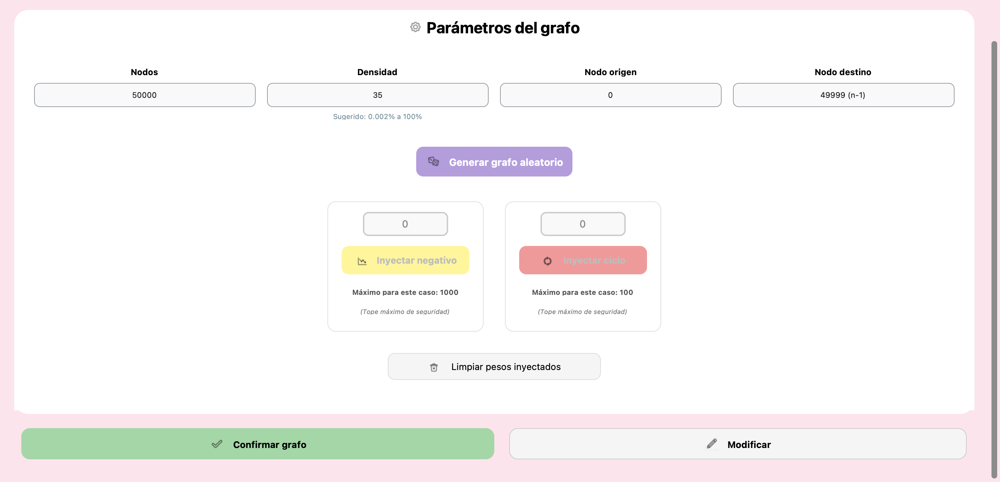](#2-indice-de-imagenes)
> 
> *Pie de imagen: interfaz optimizada para el procesamiento de grandes volúmenes de datos sin la tabla de adyacencia y el grafo.*
> 
> **Nota técnica (modo paciencia):** en situaciones de estrés masivo, si el usuario inyecta un ciclo negativo, el sistema activa un "límite de paciencia" (500,000 iteraciones) para garantizar que la aplicación siempre retorne el control al usuario y no se bloquee el sistema operativo.

#### [7.6 Comparativa y análisis de resultados](#1-indice-general)
Tras la ejecución, los velocímetros indican el tiempo en milisegundos. Generalmente, Dijkstra mostrará una ventaja significativa en tiempo, mientras que Bellman-Ford será el único en reportar correctamente la presencia de ciclos negativos.

<div id="img9"></div>
> **[Imagen 9: velocímetros de tiempo de ejecución.](#2-indice-de-imagenes)**  
> 
> [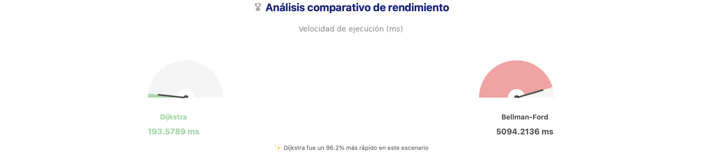](#2-indice-de-imagenes)
> 
> *Pie de imagen: indicadores radiales que permiten una comparación visual rápida de la velocidad.*

<div id="img10"></div>
> **[Imagen 10: comparativa de consumo de memoria física (RSS).](#2-indice-de-imagenes)**  
> 
> [](#2-indice-de-imagenes)
> 
> *Pie de imagen: gráfico de barras que detalla el impacto en la memoria RAM del sistema operativo para cada algoritmo.*

#### [7.7 Exportación de evidencia técnica](#1-indice-general)
El botón "Reporte PDF" genera un documento formal que incluye todos los parámetros y resultados del experimento realizado.

<div id="img11"></div>
> **[Imagen 11: guardado del reporte PDF.](#2-indice-de-imagenes)**  
> 
> [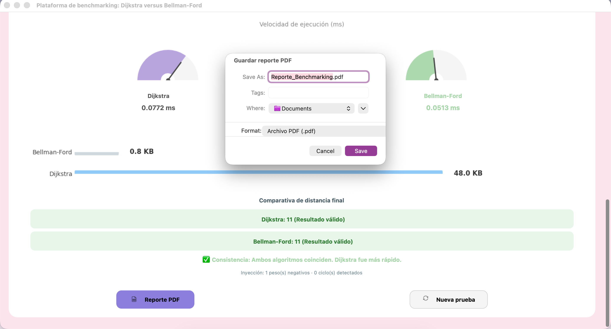](#2-indice-de-imagenes)
> 
> *Pie de imagen: ventana emergente del sistema para guardar el reporte generado.*

<div id="img12"></div>
> **[Imagen 12: visualización del reporte PDF.](#2-indice-de-imagenes)**  
> 
> [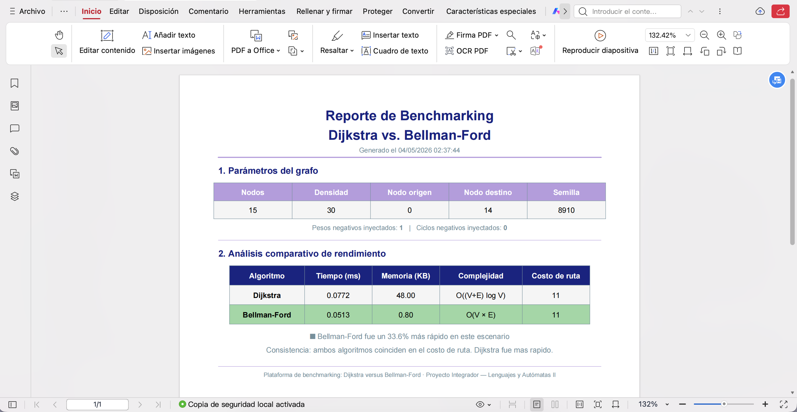](#2-indice-de-imagenes)
> 
> *Pie de imagen: visualización del reporte generado.*

---

### [8. Gestión de estados de la interfaz](#1-indice-general)

La interfaz utiliza un sistema de bloqueo para guiar al usuario:

1.  **Estado editable:** los campos de nodos y densidad están abiertos.
2.  **Estado bloqueado:** una vez generado el grafo, los parámetros iniciales se congelan para permitir inyecciones controladas.
3.  **Modificar:** desbloquea todo y reinicia la estructura del grafo.
4.  **Limpiar:** solo elimina las inyecciones de pesos, manteniendo la estructura.

<div id="img13"></div>
> **[Imagen 13: ejemplo de transición de estados de la UI (bloqueado/editable).](#2-indice-de-imagenes)**  
>
> [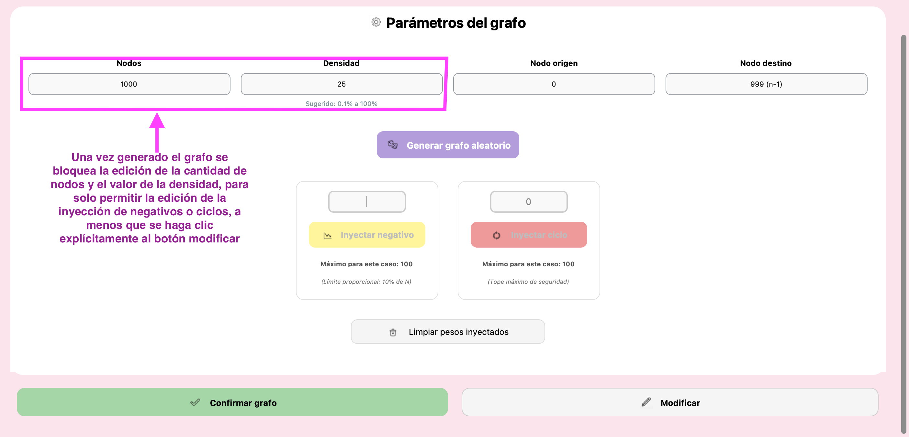](#2-indice-de-imagenes)
>
> *Pie de imagen: bloqueo de ingreso de parámetros del grafo (nodos y densidad) tras su generación para evitar errores.*

---

### [9. Resultados experimentales y análisis de escalabilidad](#1-indice-general)

Para cumplir con los estándares de optimización, se realizaron pruebas de desempeño en diferentes órdenes de magnitud. Las siguientes capturas demuestran la respuesta del sistema ante diversas densidades y tamaños de entrada.

| Escala | Nodos | Contexto de aplicación | Comportamiento observado |
| :--- | :--- | :--- | :--- |
| **Micro** | 10 - 1000 | Estructuras discretas | Ejecución casi instantánea. Diferencia de milisegundos|
| **Macro** | 1001 - 100,000 | Redes logísticas y mapas urbanos | Dijkstra domina en rapidez. Pero si hay ciclos Bellman-Ford los detecta más rápido que Dijkstra, consiguiendo mejores tiempos en ciertos casos.
| **Stress** | 100,001 - 10,000,000+ | Big Data y análisis de redes masivas | Dijkstra domina por un gran margen mientras no haya conflictos con ciclos o una gran cantidad de valores negativos.

#### [9.1 Escenario micro (auditoría visual)](#1-indice-general)
<div id="img14"></div>
> **[Imagen 14: resultados en escala pequeña (50 nodos).](#2-indice-de-imagenes)** 
>  
> [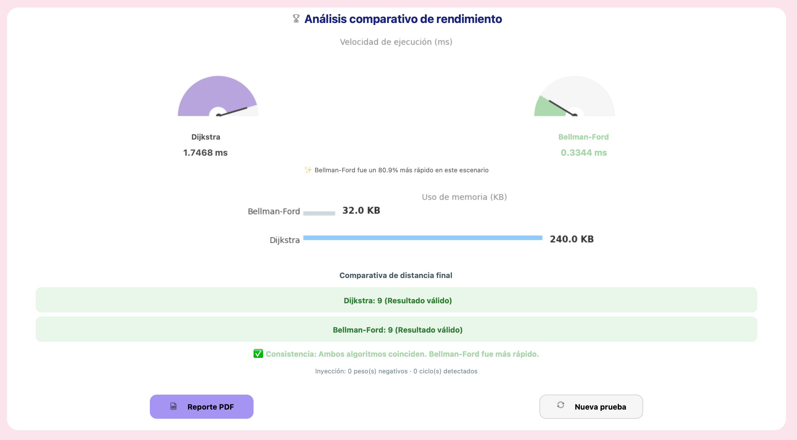](#2-indice-de-imagenes) 
> 
> *Pie de imagen: en grafos pequeños, ambos algoritmos presentan una latencia cercana.*
> 
> **Nota técnica (sobrecarga de librerías):** en esta escala micro, Bellman-Ford (SPFA) puede reportar tiempos ligeramente menores a Dijkstra. Esto no se debe a la complejidad algorítmica, sino al *overhead* (sobrecosto) inicial de invocar las librerías especializadas de SciPy frente a un bucle ligero de Python. Esta tendencia se invierte drásticamente conforme aumenta el tamaño del grafo.


#### [9.2 Escenario macro (análisis de rutas complejas)](#1-indice-general)
<div id="img15"></div>
> **[Imagen 15: resultados en escala mediana (5000 nodos).](#2-indice-de-imagenes)**  
> 
> [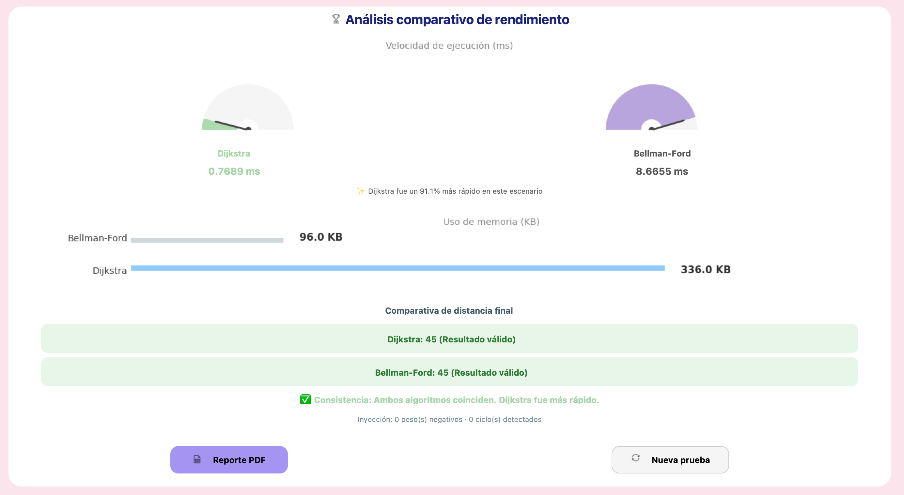](#2-indice-de-imagenes)  
> *Pie de imagen: la brecha de rendimiento comienza a ser visible; Dijkstra es notablemente más ágil.*

#### [9.3 Escenario de stress (procesamiento masivo)](#1-indice-general)
<div id="img16"></div>
> **[Imagen 16: resultados en escala masiva (10 millones de nodos).](#2-indice-de-imagenes)**  
> 
> [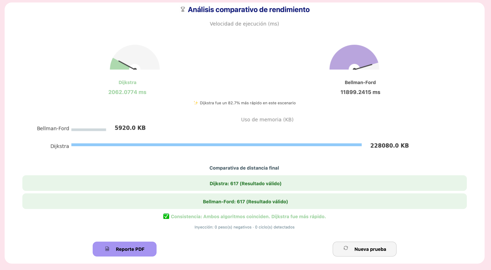](#2-indice-de-imagenes) 
>  
> *Pie de imagen: evidencia del alto rendimiento del motor híbrido procesando millones de datos en segundos, siendo Dijkstra notablemente más rápido, aunque consumiendo más recursos.*


#### [9.4 Escenario de anomalía (detección de ciclos y pesos negativos)](#1-indice-general)

<div id="img17"></div>
> **[Imagen 17: comportamiento ante pesos negativos.](#2-indice-de-imagenes)**  
> 
> [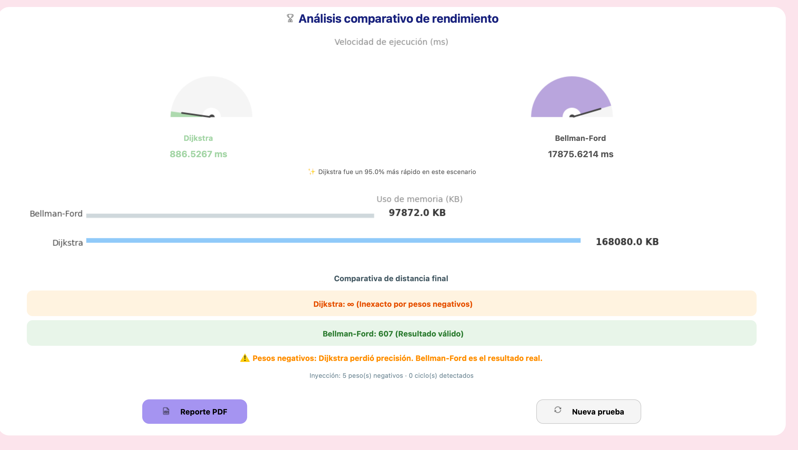](#2-indice-de-imagenes)
>   
> *Pie de imagen: Caso de estudio con 10 millones de nodos y pesos negativos. Dijkstra pierde precisión inmediatamente, mientras que Bellman-Ford resuelve la ruta óptima al no existir ciclos que la invaliden.*

**Nota técnica (detección versus. detención):** este escenario revela una diferencia fundamental de diseño. Mientras que Dijkstra debe ser **detenido** mediante un límite de iteraciones para evitar bucles infinitos ante anomalías, Bellman-Ford (SPFA) es capaz de **diagnosticar** el problema. Matemáticamente, un ciclo negativo implica que la ruta mínima tiende a **−∞**; por lo tanto, el sistema reporta un valor infinito para indicar que no existe una solución finita estable, diferenciando este caso de una simple falta de conectividad.

#### [9.5 Escenario de ciclo negativo (detección de anomalía crítica)](#1-indice-general)
<div id="img18"></div>
> **[Imagen 18: detección exitosa de un ciclo de costo infinito.](#2-indice-de-imagenes)**  
> 
> [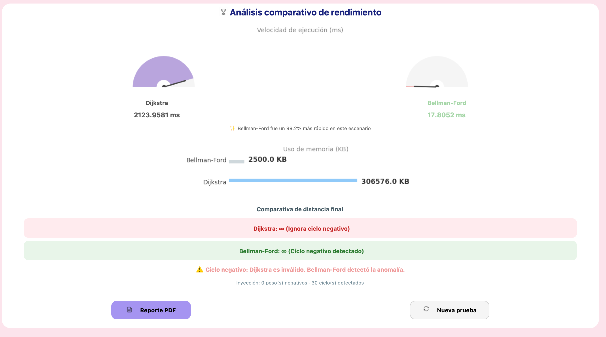](#2-indice-de-imagenes)
>   
> *Pie de imagen: caso de estudio con 50,000 nodos y ciclo negativo. Bellman-Ford (SPFA) es 99% más rápido y eficiente en memoria al diagnosticar y detener la ejecución instantáneamente, mientras que Dijkstra consume recursos masivos intentando resolver el bucle hasta ser detenido por el límite de seguridad.*

#### [9.6 Resumen de interpretación técnica](#1-indice-general)

Tras analizar los resultados en las diversas escalas, se concluye lo siguiente:

1.  **Eficiencia versus sobrecarga:** en escalas **micro**, la implementación de Bellman-Ford (SPFA) es más eficiente debido a que no incurre en el *overhead* de inicialización de librerías científicas pesadas.
2.  **Escalabilidad masiva:** en escalas de **stress** (millones de nodos), el motor de Dijkstra basado en C++ demuestra su superioridad algorítmica, procesando volúmenes masivos de datos en tiempos cortos.
3.  **Compromiso (trade-off):** el benchmark evidencia que no existe un "mejor algoritmo absoluto", sino que la elección depende del contexto: velocidad (Dijkstra) versus manejo de pesos negativos (Bellman-Ford).

---

### [10. Conclusión](#1-indice-general)

El desarrollo de este software de benchmarking demuestra que la optimización no solo se trata de elegir el algoritmo más rápido en teoría (Dijkstra), sino aquel que garantiza la integridad de los resultados según la naturaleza de los datos. A través de las pruebas empíricas, se valida que el costo computacional adicional de la programación dinámica es una inversión necesaria en redes complejas donde pueden existir **subsidios de ruta** (pesos negativos) o ciclos de costo infinito. 

Este proyecto cumple con los objetivos de la materia al evidenciar la capacidad de análisis crítico y construcción de software para la medición de desempeño computacional, entregando una herramienta capaz de distinguir entre la velocidad y la precisión necesaria en escenarios reales de logística, finanzas y Big Data.
